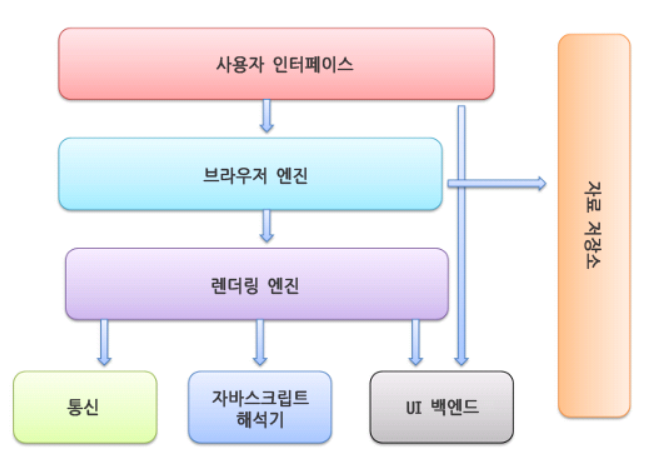
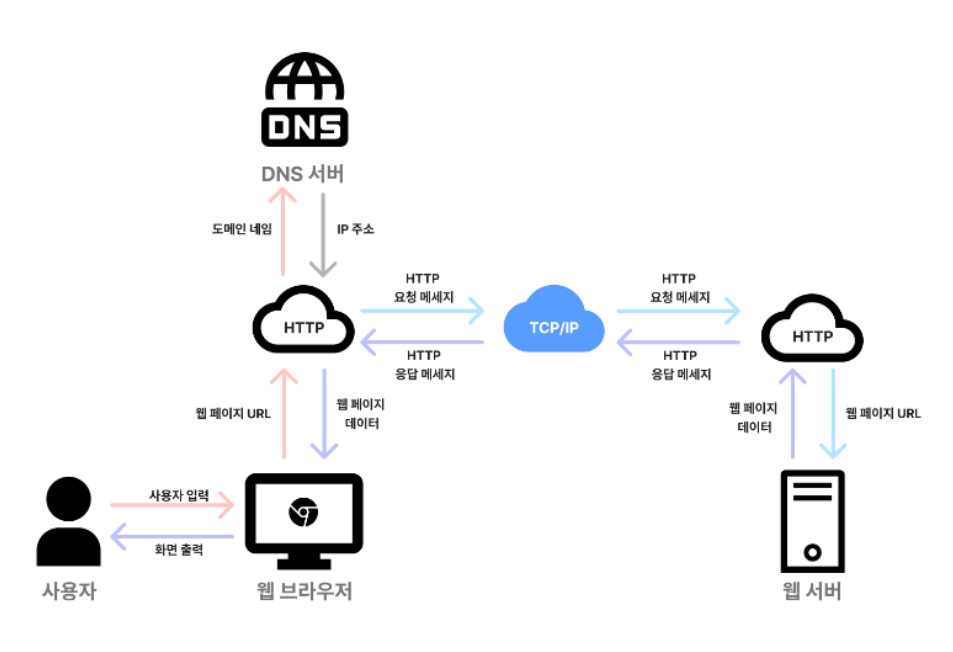

# 브라우저 동작 방식

> URL이 입력되었을 때 출력되는 방법에 대하여 알아보려고 합니다. 
>  
아래 내용을 바탕으로 설명하겠지만 출처의 내용을 일부 수정했기떄문에 작성된 내용에 일부 틀린 부분이 있을 수 있으니 수정이 필요하거나 추가할 내용이 있다면 피드백 요청드립니다!
>  
> 출처: https://d2.naver.com/helloworld/59361

### 브라우저 기본 구조

#### 브라우저의 주요 구성 요소
1. 사용자 인터페이스: 주소 표시줄, 이전/다음 버튼, 북마크 메뉴 등 요청한 페이지를 보여주는 창을 제외한 나머지 부분
2. 브라우저 엔진: 사용자 인터페이스와 렌더링 엔진 사이의 동작을 제어
3. 렌더링 엔진: 요청한 콘텐츠를 표시(ex.HTML을 요청하면 HTML/CSS를 파싱하여 화면에 표시)
4. 통신: HTTP 요청과 같은 네트워크 호출에 사용 플랫폼 독립적인 인터페이스이고 각 플랫폼 하부에서 실행
5. UI 백엔드: 콤보 박스와 창 같은 기본적인 장치를 그림 플랫폼에서 명시하지 않은 일반적인 인터페이스로서 OS 사용자 인터페이스 체계를 사용 
6. 자바스크립트 해석기: 자바스크립트 코드를 해석하고 실행
7. 자료 저장소: 자료를 저장하는 계층으로 쿠키를 저장하는 것과 같이 모든 종류의 자원을 하드 디스크에 저장할 필요가 있음 HTML5 명세에는 브라우저가 지원하는 '웹 데이터베이스'가 저장되어 있음
 
 
#### 브라우저의 동작 원리
> 브라우저는 사용자가 요청한 자원을 서버에 요청하고 서버로부터 받은 응답을 렌더링하여 웹 페이지를 표시하는 중개자 역할을 합니다.
>  
> 웹 브라우저는 이를 위해 서버와 통신하여 콘텐츠를 가져오고 HTML, CSS, JavaScript와 같은 웹 기술을 해석하고 실행하여 효과적으로 웹 페이지를 표시합니다.  

1. 사용자 요청: 사용자가 브라우저의 주소창에 URL을 입력하거나 링크를 클릭하면 브라우저는 해당 웹 페이지에 대한 요청 시작하며 사용자가 요청한 웹 페이지의 자원을 찾기 위해 DNS 조회 진행
2. DNS(Domain Name System) 조회: 브라우저는 URL에 포함된 도메인 이름을 IP 주소로 변환하기 위해 DNS서버에 요청을 보냄 이 과정에서 브라우저는 로컬 캐시, hosts 파일, DNS서버를 순차적으로 조회하여 해당 도메인에 해당하는 IP주소를 찾음
3. 서버 연결: IP 주소를 찾은 후 브라우저가 해당 서버에 TCP연결을 통해 연결 시도(클라이언트와 서버 간의 안정적인 통신 설정)
4. HTTP 요청: 브라우저는 GET, POST 등의 메서드를 사용하여 서버가 요청된 자원(HTML 문서, 이미지 등)을 반환하도록 HTTP 요청 메시지를 생성하여 서버에 보냄
5. 서버 응답: 서버가 요청에 대한 응답 메시지와 자원을 브라우저에 전송
6. 페이지 렌더링: 브라우저가 받은 데이터를 해석하여 화면에 웹 페이지 표시
---
